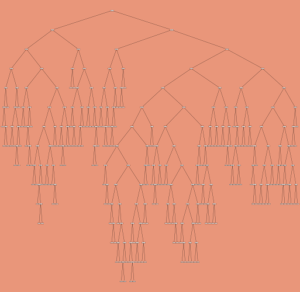

```{r setup, include=FALSE}
knitr::opts_chunk$set(echo = TRUE)
```


## 1. Introducción


El arte generativo es una forma contemporánea de creación artística, hace referencia al arte que en su totalidad o parcialmente ha sido creado con el uso de un sistema autónomo [1]. Se encuentra presente en la música, el diseño y la pintura. En este reporte se genera una colección de 10 piezas de arte generativo creadas a través de algoritmos usando funciones trigonométricas hipérbolicas, distribuciones de probabilidad multivariadas y métodos de aprendizaje estadístico.


## 2. Piezas

```{r message=FALSE, warning=FALSE, results = 'hide', echo=F, include=FALSE }

#cargas librerías necesarias

#install.packages("ggvoronoi")

library(ggplot2)
library(ggvoronoi)
library(dplyr)
library(kableExtra)

```


### Pieza 1 - Ying-Yang fragmentado

La siguiente pieza se crea inspirada en las figuras de [voronoi](https://repositorio.unican.es/xmlui/bitstream/handle/10902/18885/OrtegaDelCampoLucia.pdf?sequence=1&isAllowed=y), que consisten en construcciones geométricas que permiten realizar particiones del plano o del espacio. Los pasos a seguir en la construcción fueron:

* 1. Generar un dos sets de números aleatorios (x,y), calcular las distancias entre los puntos y guardar estos datos en un dataframe. Una vista del dataframe generado es:

```{r message=FALSE, warning=FALSE , echo=F }
#library(ggplot2)
#library(ggvoronoi)

# Generando datos para gráficar

set.seed(1)
x <- sample(1:500, size = 500)
y <- sample(1:500, size = 500)
dist <- sqrt((x - 300) ^ 2 + (y - 300) ^ 2)

df <- data.frame(x, y, dist = dist)
datos <- head(df, n=5)

kbl(datos,caption = "Tabla 1: Datos para gráficar") %>% kable_styling(latex_options = c("striped","condensed","HOLD_position"), position = "center",full_width = FALSE)
```
2. Con el set de datos y apoyándose en las librerias `ggplot2`y`ggvoronoi`, generamos un procedimiento adaptado con las funciones cosh y tanh para realizar el gráfico.  

```{r message=FALSE, warning=FALSE , echo=F, include=FALSE  }
# cola
s <- seq(0, 1 * pi, length.out = 3000)
cola <- data.frame(x = 100 * (1 + cosh(s)),
                      y = 200 * (1 + tanh(s)),
                      grupo = rep(1, 3000))

png("arte1.png")

ggplot(df, aes(x, y, fill = dist)) +
  geom_voronoi(outline = cola,
               color = 1, size = 0.1) +
  scale_fill_gradient(low = "#B9DDF1",  #"#B9DDF1"
                      high = "#2A5783",  #2A5783
                      guide = "none") +
  theme_void() +
  coord_polar()

dev.off()
 
```
En el resultado obtenido se observa la figura de voronoi generada y con su particular forma de ying-yang. Se escoge la tonalidad azul por ser la favorita del autor.

{withd=80%}

### Pieza 2 - simetría invertida

La siguiente pieza, se crea a partir de un círculo y con la función sinh se adiciona la perfecta simetría de la figura representada en las dos formas salientes del radio. Nuevamente se aprovecha `ggplot2` y variando las constantes y valores de la función e llega a esta figura.

```{r message=FALSE, warning=FALSE , echo=F, include=FALSE}
png("arte2.png")

seq(-15, 15, by = 0.05) %>%
expand.grid(x=., y=.) %>%
ggplot(aes(x=(2*x), y=(sinh(x+y)+2.8*x))) +
geom_point(alpha=.1,
           shape=20,
color="aquamarine4",
size=1)+theme_void()+
coord_polar()

dev.off()
```

{withd=80%}

### Pieza 3 - Distorsión Gaussiana

La pieza denominada Distorsión Gaussiana, se generó con apoyo de la función `mvrnorm` para poder así crear muestras a partir de la Distribución Normal Multivariada especificada. Luego, para crear la figura se empleó `ggplot2`. El resultado que se obtuvo fue el siguiente:

```{r message=FALSE, warning=FALSE , include=FALSE }
#librerias requeridas.
require(tidyverse)
require(ggplot2)
require(MASS)
require(ggvoronoi)

set.seed(12345) #Fijar una semilla.

X_0 <- sample(1:10000, size = 1000) #Muestra de tamaño mil.
y_0 <- sample(1:10000, size = 1000) #Muestra de tamaño mil.
Data <- data.frame(x = X_0, y = y_0) #Data que almacena a 'x' y 'y'.

X_1 <- mvrnorm(n = 150, mu = c(0,0,0), Sigma = diag(3)) #Especificacion de Dist Normal Multivariada.
y_1 <- mvrnorm(n = 150, mu=5, Sigma= 2, tol = 1e-06, empirical = FALSE) #Otra especificacion de Dist Normal Multivariada.

MVN <- data.frame(x = 100 * X_1, y = 100 * y_1, grupo = rep(1, 3000)) #Data asociada a las especificaciones anteriores y generando 1 replica cada 3000 veces.

#Se procede a graficar:
png("arte3.png")

ggplot(Data, aes(x=X_0, y=y_0,)) +
  geom_voronoi(outline = MVN,
               color = 5, size = 0.1) +
  theme_void() +
  coord_polar() #Generando grafico apoyado de una distribucion de probabilidad normal multivariada.

dev.off()
```

{withd=80%}

### Pieza 4 - La Normalidad de Bessel

Con apoyo de la función `Bessel` y `rlnorm` se diseñó esta pieza. Es decir, la figura tiene su base en una combinación entre las funciones de Bessel y la Distribución Lognormal Multivariada. A consecuencia de dicha unión se obtuvo la siguiente obra de arte: 

```{r message=FALSE, warning=FALSE , include=FALSE }
#Paquete requerido
require(Bessel)

set.seed(1234567890) #Se fija una semilla

x_m <- sample(1:5000, size = 2000)#Muestra de tamaño dos mil
y_m <- sample(1:5000, size = 2000)#Muestra de tamaño dos mil
Data_m <- data.frame(x_m, y_m)

x_lnorm <- sort(round(rlnorm(1000), 2)) #Dist log normal multivariada.
y_Bessel <- cbind(x_lnorm, a = besselI(x_lnorm, 3), b = BesselI(x_lnorm, 3)) #Funciones de Bessel.
x_y <- x_lnorm + y_Bessel#Se almacena lo realizado en el paso anterior en esta nueva variable

#Se procede a graficar con apoyo de ggplot2:
png("arte4.png")

ggplot(Data_m, aes(x=x_m, y=y_m)) +
    geom_voronoi(outline = x_y,
               color ="#CD0BBC", size = 0.005)+ 
  geom_point(size=0.5,stroke=1, shape=21,color="#CD0BBC")+ 
  theme_void() + coord_fixed()#Generando grafico apoyado de una distribucion log normal multivariada y  de las Funciones de Bessel.

dev.off()
```

{withd=80%}

### Pieza 5 - Rainbow.

La pieza denominada Rainbow, se generó con apoyo dedatos normales para poder así crear muestras a partir de registros los cuales son año, grupo y valores. Luego, para crear la figura se empleó `ggplot`. El resultado que se obtuvo fue el siguiente:

```{r, include=FALSE}

#Generando datos para graficar.
set.seed(11522)
library(RColorBrewer)
ngroup=50
names=paste("G_",seq(1,ngroup),sep="")
DAT=data.frame()

for(i in seq(1:30)){
    data=data.frame( matrix(0, ngroup , 3))
    data[,1]=i
    data[,2]=sample(names, nrow(data))
    data[,3]=prop.table(sample( c(rep(0,100),c(1:ngroup)) ,nrow(data)))
    DAT=rbind(DAT,data)
    }
colnames(DAT)=c("Year","Group","Value")
DAT=DAT[order( DAT$Year, DAT$Group) , ]


coul = brewer.pal(12, "Paired") 
coul = colorRampPalette(coul)(ngroup)
coul=coul[sample(c(1:length(coul)) , size=length(coul) ) ]
```

```{r, include=FALSE}
#Grafica
png("arte5.png")

ggplot(DAT, aes(x=Year, y=Value, fill=Group )) + 
    geom_area(alpha=1  )+
    theme_bw() +
    #scale_fill_brewer(colour="red", breaks=rev(levels(DAT$Group)))+
    scale_fill_manual(values = coul)+
     theme(
        text = element_blank(),
        line = element_blank(),
        title = element_blank(),
        legend.position="none",
        panel.border = element_blank(),
        panel.background = element_blank())

dev.off()
```

{withd=80%}

### Pieza 6 - Gamma Big Bang

La pieza denominada Gamma Big Bang, se generó con apoyo de la función `rgamma` para poder así crear muestras aleatorias a partir de la Distribución Gamma especificada. Luego, para crear la figura se empleó el devtools`djnavarro/jasmines`. El resultado que se obtuvo fue el siguiente:

```{r, include=FALSE}
#Paquete requeridos
#install.packages("scico")     
#install.packages("TSP")     
#devtools::install_github("djnavarro/jasmines")           

library(ggplot2)
library(dplyr)
library(scico)
library(TSP)
library(tidyverse)
library(jasmines)

png("arte6.png")

use_seed(11522) %>%
  scene_discs(
    rings = 20, 
    points = rgamma(3, 1,1)*1000, 
    size = 5
  ) %>%
  mutate(ind = 1:n()) %>%
  unfold_warp(
    iterations = 2,
    scale = 0.5, 
    output = "layer" 
  ) %>%
  unfold_tempest(
    iterations = 20,
    scale = 0.01
  ) %>%
  style_ribbon(
    palette = palette_named("plasma"),
    colour = "ind",
    alpha = c(0.1, 0.1),
    background = "#FBE5E240"
  )

dev.off()

```

{withd=80%}

### Pieza 7 - Tornado

La siguiente pieza, se crea a partir del experimento tornado de StarCircle hecho por Sanjeev Kumar creando un aspecto tridimensional, casi esférico [2]. El tornado presenta pequeñas modificaciones para estar más cerrado, aumentando su secuencia, cambiando la función `(cos(y+x)+1.3*y)` por `(cos(y+x)+10*y)` en el eje X y `(sin(x+y)+2.3*x)` por `(sin(x+y)+0.1*x)` en el eje Y. Nuevamente se hace usos de  `ggplot2` llegando a esta figura.

```{r, include=FALSE}
png("arte7.png") 

#seq(-12, 12, by = 0.1) %>%
#expand.grid(x=., y=.) %>%
#ggplot(aes(x=(cos(y+x)+1.3*y), y=(sin(x+y)+2.3*x))) +
#geom_point(alpha=.05,
#           shape=20,
#color="red",
#size=1)+theme_void()+
#coord_polar()

seq(-20, 20, by = 0.1) %>%
expand.grid(x=., y=.) %>%
ggplot(aes(x=(cos(y+x)+10*y), y=(sin(x+y)+0.1*x))) +
geom_point(alpha=.05,
           shape=20,
color="red",
size=1)+theme_void()+
coord_polar()

dev.off()
```

{withd=80%}

### Pieza 8 - Casualidad

La siguiente pieza, se crea a partir de los datos X y Y de la pieza 3, Distorsión Gaussiana, realizando todas las combinaciones posibles entre los dos factores con la función `expand.grid()` y la función `(cos(y+x)+1.3*y)` en el eje X y `(sin(x+y)+2.3*x)` en el eje Y. Dando como resultado la siguiente figura.

```{r, include=FALSE}
png("arte8.png")

expand.grid(x=X_1, y=y_1) %>%
ggplot(aes(x=(cos(y+x)+1.3*y), y=(sin(x+y)+2.3*x))) +
geom_point(alpha=.05,
           shape=20,
color="red",
size=1)+theme_void()+
coord_polar()

dev.off()
```

{withd=80%}

### Pieza 9 - tree_1

Para el tree_1.png se muestra una grafica creada a partir de random forest generado con un gran dataset de sklearn, es interesante ver como con la gran cantidad de datos salen muchas ramas que pueden parecer una granja de hormigas o un enorme árbol genealógico o de evolución.

{withd=80%}

### Pieza 10 - tree_2

Para el tree_2.png se muestra igualmente una grafica generada con random forest y el mismo dataset, es menos llamativo y al parecer menos complejo pero realmente puede variar más visualmente, las formas que muestra pueden parecerse a un cerebro, un elefante, un cráneo... depende la percepción de quein lo esté viendo y de como se alla generado la imagen aleatoriamente, todos los pequeños letreros o cuadros de la imagen son valores de las hojas del random forest, los valores del dataset son irrelevantes para lo que estamos haciendo, sólo pueden variar el color de cada uno de estos letreros naranjas.

{withd=80%}

## 3. Conclusiones

- Las piezas artísticas creadas por medio de las técnicas afianzadas en el curso son una muestra de lo bello que es la Ciencia. Es decir, no solamente aplicar métodos matemáticos y estadísticos para solucionar problemas de la cotidianidad, sino ahora para hacer de ello algo más tangible, proyectado en una serie de imágenes, para que se pueda apreciar también por personas que no necesariamente están inmersas en este mundo las ciencias formales.

- Fue un excelente reto hacer este proyecto, ya que ninguno estaba familiarizado con el concepto de "Arte Generativo". Además, considerando que se está culminando el período académico sirvió de terapia antiestrés realizar cada figura.

- Las piezas que se generaron para este trabajo van desde metodologías como "random forest", hasta "funciones de Bessel", lo cual implica que se proporcionó gran variedad de contenido y hace que implícitamente se note la seriedad y compromiso con el que se tomó el último trabajo para dicho curso.


## 4. Enlaces de interés


Usted puede revisar el código y los datos usados en este proyecto en nuestro repositorio en [Github](https://github.com/daatoroag/PROYECTOS-TAE/tree/main/Cuarta%20entrega)


## 5. Referencias

[1]https://www.hisour.com/es/generative-art-21197/

[2]https://www.aamlai.com/2020/05/27/experiments-in-generative-art-with-rstats/

